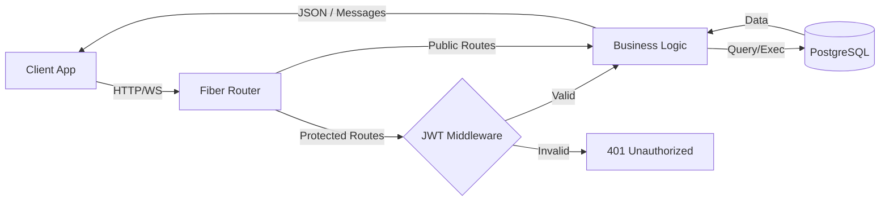
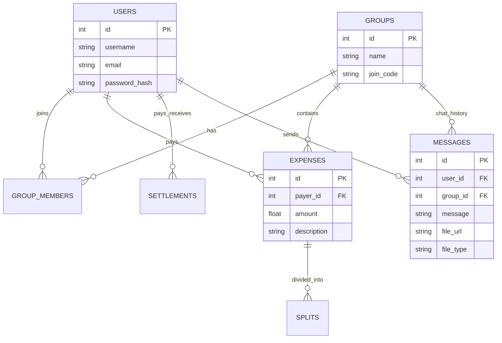
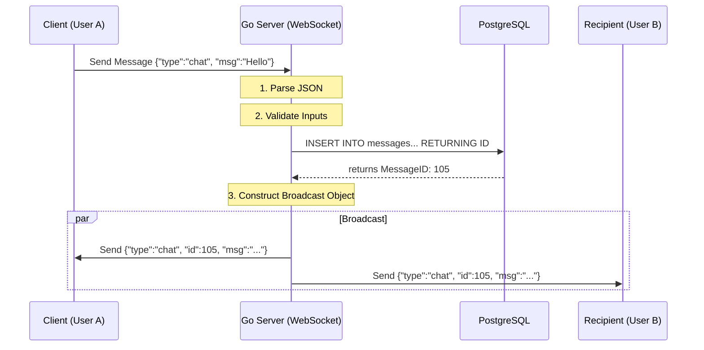

# 💰 HisabKitab — Backend

**HisabKitab** is a high-performance backend for a group expense splitting and real-time chat application. Built with **Go (Golang)** and **Fiber**, backed by **PostgreSQL**.

This system handles complex debt simplification (like Splitwise), secure JWT authentication, and persistent real-time messaging.

---

## 🚀 Features

- **👥 Group Management** — Create groups, generate 6-digit join codes, and manage memberships.
- **💸 Expense Splitting** — Support for Equal and Custom splits between group members.
- **📉 Debt Simplification** — Graph-based algorithm to minimize total transactions.
- **💬 Real-Time Chat** — Persistent chat history with optional file attachments via WebSockets.
- **🔐 Authentication** — JWT-based auth with bcrypt password hashing.
- **📜 Activity Feed** — Combined feed of expenses and settlements.

---

## 🛠 Tech Stack

- **Language:** Go (Golang) v1.24+
- **Framework:** Fiber v2
- **Database:** PostgreSQL
- **Real-Time:** gofiber/contrib/websocket
- **Drivers:** lib/pq
- **Security:** golang-jwt/jwt/v5, x/crypto/bcrypt

---

## 📂 Project Structure

```bash
go_backend/
├── config/
│   └── db.go                # Database connection setup
├── handlers/               # Business logic controllers
│   ├── auth.go             # Signup & Login
│   ├── groups.go           # Group creation & management
│   ├── expenses.go         # Expense creation & splitting
│   ├── simplify.go         # Debt simplification algorithm
│   ├── websocket.go        # Real-time chat handler
│   └── ...
├── middleware/
│   └── auth.go             # JWT protection middleware
├── models/                 # Struct definitions
├── routes/
│   └── routes.go           # API route definitions
├── main.go                 # Entry point
├── .env                    # Environment variables
└── go.mod                  # Dependencies
```
---

## 📊 System Architecture
High-Level Request Flow


---

## 🗄 Database Schema


---

## 🔌 Real-Time Chat Architecture

The chat system uses **WebSockets** to provide instant updates. Messages are persisted to **PostgreSQL** to ensure chat history is preserved.

### Chat Pipeline

1. **Connection**  
   Client upgrades HTTP → WebSocket.

2. **Hub Registration**  
   Client joins a Hub (room) via `groupID`.

3. **Message Loop**

   - **Receive:** Server reads JSON payload.
   - **Persist:** Server stores message + file metadata in PostgreSQL.
   - **Enrich:** Server retrieves the generated `message_id`.
   - **Broadcast:** Server sends the enriched object to all active clients in the hub.


---

## 🧠 Key Algorithms
### Debt Simplification (Graph Reduction)

Located in `handlers/simplify.go`.
Instead of everyone paying everyone, the system calculates the **Net Balance** for each user in a group to minimize transactions.

### Steps:

1. **Calculate Net Flow** 
```text
Net = Total Paid - Total Owed
```
2. **Separate Users:**  
-- Debtors: Net < 0 
-- Creditors: Net > 0
3. **Greedy Match:**
-- Take the biggest Debtor and the biggest Creditor. 
-- Match them: The Debtor pays the Creditor the minimum of the two absolute values: $$ \min(|debt|, credit) $$ --Update balances and repeat until all debts are settled.

